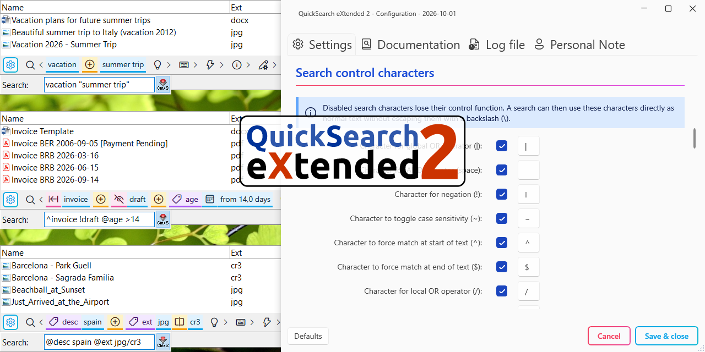

# 🔍 QuickSearch eXtended 2

- 🏠 **[Projektseite & Quellcode](https://github.com/SamuelPlentz/QSX2)**
- 📜 **[Versionshistorie](https://github.com/SamuelPlentz/QSX2/blob/main/CHANGELOG.md)**
- 🐞 **[Fehler melden & Vorschläge machen](https://github.com/SamuelPlentz/QSX2/issues)**
- 💬 **[Austausch im Total Commander Forum](https://www.ghisler.ch/board/viewtopic.php?t=88089)**

---

<a id="inhaltsverzeichnis"></a>
# 📖 Inhaltsverzeichnis

- 🚀 [1. Einführung](#einfuehrung)
- 🧠 [2. Suchsyntax](#suchsyntax)
    - 💡 [2.1 Kernidee](#kernidee)
    - 🧬 [2.2 Anatomie einer Suchanfrage](#anatomie-einer-suchanfrage)
    - 🔍 [2.3 Suchmodi](#suchmodi)
        - 🔍 [2.3.1 Standard-Suche (`=`)](#standard-suche)
        - 🔍 [2.3.2 Regex-Suche (`?`)](#regex-suche)
        - 🔍 [2.3.3 Mustersuche (`%`)](#mustersuche)
        - 🔍 [2.3.4 Fuzzy-Suche (`<`)](#fuzzy-suche)
        - 🔍 [2.3.5 Sequenz-Suche (`*`)](#sequenz-suche)
    - 🏷️ [2.4 Metadaten](#metadaten)
    - 🛡️ [2.5 Maskieren von Zeichen (`\` und `"..."`)](#maskieren-von-zeichen)
    - 🎯 [2.6 Praktische Suchbeispiele](#praktische-suchbeispiele)
- ⚡ [3. Vorverarbeitung & Zeichenäquivalenz](#vorverarbeitung-zeichenaequivalenz)
    - 🔄 [3.1 Funktionsweise der Vorverarbeitung](#funktionsweise-der-vorverarbeitung)
    - 🔀 [3.2 Funktionsweise der Zeichenäquivalenz](#funktionsweise-der-zeichenaequivalenz)
    - 🌏 [3.3 Chinesische Suche (PinYin)](#chinesische-suche-pinyin)
    - 🌏 [3.4 Koreanische Suche (Hangul)](#koreanische-suche-hangul)
    - 📝 [3.5 Ersetzungsregeln](#ersetzungsregeln)
    - 🧩 [3.6 Vorlagen](#vorlagen)
- 💡 [4. Der interaktive Suchassistent](#der-interaktive-suchassistent)
- ⚙️ [5. Einstellungen](#einstellungen)
    - 🌍 [5.1 Eigene Übersetzungen](#eigene-uebersetzungen)
    - 🎨 [5.2 Eigene Themes](#eigene-themes)
- 📦 [6. Installation](#installation)
    - 📂 [6.1 Alternativer Installationsordner](#alternativer-installationsordner)
    - 📂 [6.2 Verzeichnis-Umleitung](#verzeichnis-umleitung)
- 🛠️ [7. Systemgrenzen & Fehlerbehebung](#systemgrenzen-fehlerbehebung)
    - ⚙️ [7.1 Funktionsweise & Grenzen der `tcmatch.dll`-Schnittstelle](#funktionsweise-grenzen-der-tcmatch-dll-schnittstelle)
    - 🚧 [7.2 Bekannte Einschränkungen](#bekannte-einschraenkungen)
    - 📋 [7.3 Checkliste zur Fehlerbehebung](#checkliste-zur-fehlerbehebung)
- 📜 [8. Danksagung & Rechtliches](#danksagung-rechtliches)
    - 👥 [8.1 Mitwirkende](#mitwirkende)
    - 📦 [8.2 Danksagung](#danksagung)
    - ⚖️ [8.3 Lizenzbedingungen](#lizenzbedingungen)
- ✍️ [9. Persönliches](#persoenliches)

---

<a id="einfuehrung"></a>
# 🚀 1. Einführung

## 💡 Was ist QuickSearch eXtended 2?

**QuickSearch eXtended 2** ist ein hochflexibles Schnellsuche-Plugin für den **Schnellfilter-Dialog** (Strg+S) von **[Total Commander](https://www.ghisler.com/)**. Es verwandelt eine einfache Texteingabe in ein mächtiges Suchwerkzeug, mit dem Dateien und Ordner blitzschnell nach komplexen Kriterien gefiltert werden können.

Die mehrschichtige Suchsyntax kombiniert Standard-Textfilter, reguläre Ausdrücke, unscharfe Fuzzy-Suche und Metadaten-Abfragen nahtlos in einer einzigen Zeile, ohne dass komplexe Klammern erforderlich sind.

Egal ob nach Mustern, Dateialter, Dateigröße, Inhalten oder WDX-Inhalts-Plugins gefiltert wird – das Plugin interpretiert die Eingabe in Echtzeit und liefert über den **interaktiven Suchassistenten** direkte Rückmeldung zur aufgebauten Suchlogik.

<!-- SCREENSHOT-START -->

<!-- SCREENSHOT-END -->

Screenshot in voller Größe: [☀️ Heller Modus](https://github.com/SamuelPlentz/QSX2/blob/main/data/screenshots/SearchAssistant-Examples-Light.png) · [🌙 Dunkler Modus](https://github.com/SamuelPlentz/QSX2/blob/main/data/screenshots/SearchAssistant-Examples-Dark.png)

[📖 Nach oben](#inhaltsverzeichnis)

---

## ⭐ Die wichtigsten Features auf einen Blick

- 🧩 **Mächtige Verknüpfungslogik:** Bedingungen lassen sich beliebig mit UND, ODER und NEGATION kombinieren.
- 🔍 **5 flexible Suchmodi:** Unterstützung für exakte Standard-Suche, Mustersuche, Sequenz-Suche, unscharfe Fuzzy-Suche sowie leistungsstarke reguläre Ausdrücke.
- 🏷️ **Umfangreiche Metadaten-Filterung:** Gezieltes Filtern nach Dateiname, Erweiterung, Pfad, Kommentar, Volltextinhalt, Dateialter, Dateigröße oder Dateiattributen.
- 🔌 **WDX-Plugin-Integration:** Felder aus externen Total-Commander-Inhalts-Plugins können direkt eingebunden werden (z. B. MP3-Tags, Exif-Daten, PDF-Eigenschaften).
- 💡 **Interaktiver Suchassistent:** Ein mitlaufendes Fenster zeigt in Echtzeit die interpretierte Suchstruktur, erkannte Steuerzeichen, Performance-Warnungen, Hinweise und den bisherigen Suchverlauf an.
- 🛠️ **Vollständig anpassbar:** Jedes einzelne Steuerzeichen und jedes Metadaten-Kürzel kann in der Konfiguration frei umdefiniert oder komplett deaktiviert werden.
- 🔄 **Textersetzungen:** Integrierte Unterstützung für das Ignorieren von Umlauten und Akzenten, chinesische PinYin- und koreanische Hangul-Suche sowie benutzerdefinierte Ersetzungsregeln.
- 🎨 **Modernes Erscheinungsbild:** Unterstützt den Dark Mode und ermöglicht Farbanpassungen. Das Plugin ist mehrsprachig und lässt sich einfach übersetzen.

[📖 Nach oben](#inhaltsverzeichnis)

---

<a id="suchsyntax"></a>
# 🧠 2. Suchsyntax

<a id="kernidee"></a>
## 💡 2.1 Kernidee

Die Reihenfolge der Suchwörter spielt keine Rolle. Beispielsweise findet die Suche nach `invoice final` sowohl `invoice_final.pdf` als auch `final_invoice.txt`.

> 💡 Soll eine exakte Reihenfolge erzwungen werden, lässt sich dies über die Mustersuche lösen (z. B. findet `%invoice*final` zwar `invoice_final.pdf`, schließt `final_invoice.txt` jedoch aus; siehe 🔍 [2.3.3 Mustersuche](#mustersuche)).

Die Engine zerlegt den Suchstring in unabhängige Pfade. Folgendes Beispiel veranschaulicht diese Funktionsweise:

```text
client xlsx/docx !rejected | invoice final
```

Diese einzelne Zeile wird in **zwei völlig unabhängige Zweige** aufgeteilt, die durch das globale ODER (`|`) getrennt sind:

- **Zweig 1 (3 Bedingungen):**
    - `client` → Dateiname muss `client` enthalten.
    - **UND**
    - `xlsx/docx` → Dateiname muss `xlsx` **ODER** `docx` enthalten (Lokales ODER).
    - **UND**
    - `!rejected` → Dateiname darf **NICHT** `rejected` enthalten (Negation).
- **Zweig 2 (2 Bedingungen):**
    - `invoice` → Dateiname muss `invoice` enthalten.
    - **UND**
    - `final` → Dateiname muss `final` enthalten.

Die folgende Tabelle zeigt, wie diese Beispielabfrage für verschiedene Dateinamen ausgewertet wird:

| Treffer | Dateiname                    | Passender Zweig / Grund für Ausschluss                                                                                                              |
| :---:   | :---                         | :---                                                                                                                                                |
| **✅** | `invoice_final.pdf`          | **Zweig 2 passt:** Enthält `invoice` UND `final`.                                                                                                    |
| **✅** | `final_invoice.txt`          | **Zweig 2 passt:** Enthält `invoice` UND `final` in anderer Reihenfolge.                                                                             |
| **✅** | `2026_client_report.docx`    | **Zweig 1 passt:** Enthält `client` UND `docx` und enthält nicht `rejected`.                                                                         |
| **✅** | `final_client.xlsx`          | **Zweig 1 passt:** Enthält `client` UND `xlsx` und enthält nicht `rejected`.                                                                         |
| **✅** | `final_invoice_rejected.txt` | **Zweig 2 passt:** Enthält `invoice` UND `final`. Das Wort `rejected` ist nur in Zweig 1 ausgeschlossen, sodass Zweig 2 diese Datei dennoch erfasst. |
| **❌** | `client_rejected_sheet.xlsx` | **Ausgeschlossen:** Enthält `rejected`, was Zweig 1 verletzt. Das für Zweig 2 erforderliche Schlüsselwort `invoice` fehlt ebenfalls.                 |
| **❌** | `rejected.png`               | **Ausgeschlossen:** Ungünstigste Datei überhaupt 😉.                                                                                                 |

[📖 Nach oben](#inhaltsverzeichnis)

---

<a id="anatomie-einer-suchanfrage"></a>
## 🧬 2.2 Anatomie einer Suchanfrage

Die Eingabe wird wie ein Satz von Bausteinen gelesen und von den größten Einheiten (Zweigen) bis hin zu den kleinsten Elementen (Begriffen) verarbeitet:

- **Suchstring** = `Zweig1|Zweig2|Zweig3|...`
    - **Globales ODER:** Teilt die Suche mithilfe des Zeichens `|` in völlig separate **Zweige** auf. Wenn **irgendein** einzelner Zweig auf die Datei passt, wird sie gefunden.
- **Zweig** = `Bedingung1 Bedingung2 Bedingung3 ...`
    - **UND:** Trennt die einzelnen **Bedingungen** innerhalb eines Zweigs durch ein Leerzeichen (` `). Ein Zweig ist nur dann erfüllt, wenn **alle** seine Bedingungen zutreffen.
- **Bedingung** = `[!][~][^][$][Suchmodus]Begriff1/Begriff2/Begriff3/...`
    - **Negation:** Ein optionales Präfix mit dem Zeichen `!`, das das Ergebnis umkehrt. Die Datei darf diese Bedingung **nicht** erfüllen.
    - **Groß-/Kleinschreibung umschalten:** Ein optionales Präfix mit dem Zeichen `~`, das den globalen Status der Groß-/Kleinschreibung für diese spezifische Bedingung umkehrt. Ist die globale Einstellung schreibweisen-unabhängig, wird diese Bedingung schreibweisen-abhängig und umgekehrt.
    - **Textanfang:** Ein optionales Präfix mit dem Zeichen `^`, das erzwingt, dass diese Bedingung am exakten Anfang des Dateinamens übereinstimmt.
    - **Textende:** Ein optionales Präfix mit dem Zeichen `$`, das erzwingt, dass diese Bedingung am exakten Ende des Dateinamens übereinstimmt (inklusive Dateiendung).
    - **Suchmodus:** Ein optionales **Steuerzeichen** (siehe 🔍 [2.3 Suchmodi](#suchmodi)), das die Verarbeitungsart des Textes ändert (z. B. Regex- oder Fuzzy-Suche).
    - **Lokales ODER:** Ermöglicht eine Auswahl alternativer **Begriffe** innerhalb einer einzelnen Bedingung mithilfe des Zeichens `/`. Nur **einer** dieser Begriffe muss enthalten sein (ideal für Dateiendungen wie `jpg/png/gif`).

Jedes Steuerzeichen kann in den Einstellungen vollständig angepasst oder deaktiviert werden.

[📖 Nach oben](#inhaltsverzeichnis)

---

<a id="suchmodi"></a>
## 🔍 2.3 Suchmodi

Standardmäßig wird jeder Begriff einer Bedingung im **Standard-Suchmodus** aus den Einstellungen ausgewertet. Um die Auswertung für eine einzelne Bedingung gezielt anzupassen, wird dieser ein entsprechendes **Suchmodus-Steuerzeichen** vorangestellt (siehe 🧬 [2.2 Anatomie einer Suchanfrage](#anatomie-einer-suchanfrage)).

Die folgenden Modi stehen zur Verfügung:

- 🔍 [2.3.1 Standard-Suche (`=`)](#standard-suche)
- 🔍 [2.3.2 Regex-Suche (`?`)](#regex-suche)
- 🔍 [2.3.3 Mustersuche (`%`)](#mustersuche)
- 🔍 [2.3.4 Fuzzy-Suche (`<`)](#fuzzy-suche)
- 🔍 [2.3.5 Sequenz-Suche (`*`)](#sequenz-suche)

> 💡 **Einschränkungen:** Bei der **Regex-Suche** (`?`) und der **Mustersuche** (`%`) kann das lokale ODER (`/`) innerhalb der Bedingung nicht verwendet werden. Zudem stehen dort die meisten Textersetzungen (PinYin-Suche, Hangul-Suche, Umlaute/Akzente ignorieren sowie 1:1-Zuordnungen) nicht zur Verfügung.

Jedes Steuerzeichen kann in den Einstellungen vollständig angepasst oder deaktiviert werden.

[📖 Nach oben](#inhaltsverzeichnis)

---

<a id="standard-suche"></a>
### 🔍 2.3.1 Standard-Suche (`=`)

Sucht an einer beliebigen Stelle des Dateinamens nach dem exakten **Begriff**.

- **Suchmodus-Steuerzeichen:** `=`
- **Beispiel:** `=report` findet `annual_report_2026.pdf`.

> 💡 Standardmäßig ist die **Standard-Suche** in den Einstellungen bereits als aktiver Modus hinterlegt. Das Steuerzeichen `=` kann in diesem Fall weggelassen werden (`report` statt `=report`). Es wird nur benötigt, wenn in den Einstellungen ein anderer Modus als Standard gewählt wurde und für eine einzelne Bedingung explizit eine exakte Suche erzwungen werden soll.

[📖 Nach oben](#inhaltsverzeichnis)

---

<a id="regex-suche"></a>
### 🔍 2.3.2 Regex-Suche (`?`)

Wertet den **Begriff** als regulären Ausdruck auf Basis der [.NET Regular Expression Engine](https://learn.microsoft.com/en-us/dotnet/standard/base-types/regular-expression-language-quick-reference) aus. Dies ermöglicht hochflexible Musterprüfungen und komplexe Zeichenketten-Filterungen.

- **Suchmodus-Steuerzeichen:** `?`
- **Beispiel:** `?202[3-6].*Invoice` findet Dateien, die eine Jahreszahl von 2023 bis 2026 enthalten, gefolgt von beliebigen Zeichen und dem Wort `invoice` (z. B. `2024_05_Invoice.pdf` oder `2026-Company-Invoice.xlsx`).

[📖 Nach oben](#inhaltsverzeichnis)

---

<a id="mustersuche"></a>
### 🔍 2.3.3 Mustersuche (`%`)

Wertet den **Begriff** über eine eigens definierte, intuitive Syntax aus. Sie bietet eine leistungsfähige Platzhalter-Suche mit Ziffern-, Zeichen- und Bereichsunterstützung, ohne dass komplexe reguläre Ausdrücke erlernt werden müssen. Die verschiedenen Elemente dieser Syntax werden nachfolgend im Detail erklärt.

- **Suchmodus-Steuerzeichen:** `%`
- **Beispiel:** `%[2013..2026]*Invoice` findet Dateien, die eine Jahreszahl von 2013 bis 2026 enthalten, gefolgt von beliebigen Zeichen und dem Wort `invoice` (z. B. `2014_05_Invoice.pdf` oder `2026-Company-Invoice.xlsx`).

---

**🔹 Einfache Platzhalter**

| Zeichen | Bedeutung                           | Beispiel            | Trefferbeispiel                                         |
| :---:   | :---                                | :---                | :---                                                    |
| **`*`** | Beliebig viele Zeichen (oder keins) | `%report*.txt`      | `Report.txt`, `Report_2026.txt`                         |
| **`?`** | Genau **1** beliebiges Zeichen      | `%image?.png`       | `image1.png`, `ImageA.png` *(aber nicht `image12.png`)* |
| **`#`** | Genau **1 Ziffer** (0–9)            | `%invoice_####.pdf` | `invoice_2026.pdf`                                      |
| **`@`** | Genau **1 Buchstabe**               | `%code_@@.dat`      | `Code_AB.dat`                                           |

---

**🔹 Zeichen-Auswahl `[abc]`**

Findet genau ein Zeichen aus der angegebenen Auswahl in der Klammer.

- **Beispiel:** `%file_[abc].txt` findet `file_a.txt`, `file_b.txt` oder `file_c.txt`.

---

**🔹 Zeichen-Ausschluss `[!abc]`**

Findet genau ein Zeichen, das **nicht** in der Klammer steht.

- **Beispiel:** `%version_[!12].log` findet `version_3.log`, aber nicht `version_1.log` oder `version_2.log`.

---

**🔹 Wort-Auswahl `(Wort1,Wort2)`**

Sucht nach einem der angegebenen Wörter innerhalb der Klammer (ODER-Verknüpfung).

- **Beispiel:** `%(vacation,trip)_2025` findet `vacation_2025.jpg` oder `trip_2025.pdf`.

---

**🔹 Zahlen- und Datumsbereiche `[von..bis]`**

Ermöglicht die Prüfung von aufsteigenden Wertebereichen bei Zahlen, Datumsangaben, Versionen oder anderen Mustern, die Ziffern enthalten.

**Regeln:**

- **Bereichsgrenzen:** Können geschlossen (`[1..100]`) oder offen (`[2010..]` bzw. `[..2026]`) angegeben werden.
- **Längenbindung:** Start- und Endwert definieren die erlaubte Ziffernanzahl pro Segment. `[7..]` sucht einstellig (7–9), während `[007..]` exakt dreistellig sucht (007–999).
- **Strukturtreue:** Alle enthaltenen Zeichen außer den Ziffern müssen vorn und hinten an exakt denselben Positionen stehen (`[1-322.7..5-720.3]`).

**Beispiele:**

| Muster                                  | Trefferbeispiele                                   | Kein Treffer                      |
| ---                                     | ---                                                | ---                               |
| `%image_[003..077].png`                 | `image_007.png`, `image_045.png`                   | `image_15.png`, `image_093.png`   |
| `%report_[7..103].pdf`                  | `report_9.pdf`, `report_42.pdf`, `report_042.pdf`  | `report_1.pdf`, `report_0042.pdf` |
| `%file_[7..].txt`                       | `file_7.txt`, `file_9.txt`                         | `file_08.txt`, `file_99.txt`      |
| `%file_[003..].txt`                     | `file_007.txt`, `file_500.txt`, `file_987.txt`     | `file_3.txt`, `file_1500.txt`     |
| `%app_v[7.32..12.3].exe`                | `app_v8.02.exe`, `app_v10.1.exe`, `app_v12.02.exe` | `app_v10.131.exe`, `app_v11.exe`  |
| `%archive_[1980-04-16..1983-09-18].tar` | `archive_1982-12-03.tar`, `archive_1980-05-99.tar` | `archive_1980-03-29.tar`          |
| `%log_[12.03.2024..19.07.2026].txt`     | `log_01.04.2024.txt`, `log_99.99.2025.txt`         | `log_15.05.2023.txt`              |
| `%volume-[1-part-12..3-part-02].dat`    | `Volume-1-part-17.dat`, `Volume-2-part-99.dat`     | `Volume-3-part-11.dat`            |

---

**🔹 Sonderzeichen als Text suchen**

Sollen Steuerzeichen der Mustersuche (wie `#`, `@`, `*` oder `?`) als gewöhnlicher Text gesucht werden, stehen zwei Methoden zur Verfügung:

Das Steuerzeichen wird als einzelnes Zeichen in eckige Klammern `[...]` gesetzt und dadurch wörtlich interpretiert.

- **Beispiel:** `%file_[#]` findet exakt `file_#.txt`.

Ein vorangestellter Backslash (`\`) hebt die Steuerfunktion des nachfolgenden Zeichens auf:

- **Beispiel:** `%file_\#` findet exakt `file_#.txt`.

> 💡 Falls die Zeichen `\` und `"` in den Einstellungen bereits zum Maskieren verwendet werden, muss entweder `%file_\\#` oder `%"file_\#"` geschrieben werden (siehe 🛡️ [2.5 Maskieren von Zeichen](#maskieren-von-zeichen)).

[📖 Nach oben](#inhaltsverzeichnis)

---

<a id="fuzzy-suche"></a>
### 🔍 2.3.4 Fuzzy-Suche (`<`)

Verwendet die [Levenshtein-Distanz](https://de.wikipedia.org/wiki/Levenshtein-Distanz), um Begriffe auch bei Tippfehlern oder abweichenden Schreibweisen zuverlässig zu finden.

- **Suchmodus-Steuerzeichen:** `<`
- **Fehlertoleranz:** Um Fehlalarme bei kurzen Begriffen zu vermeiden, skaliert die erlaubte Abweichung dynamisch mit der Länge des Suchterms. Die Schwellenwerte für die Zuweisung der zulässigen Fehler lassen sich in den Einstellungen anpassen:
    - **3+ Zeichen:** Maximal **1 Fehler** (z. B. `<color` findet `colour.txt` trotz des zusätzlichen `u`).
    - **10+ Zeichen:** Maximal **2 Fehler** (z. B. `<preasentatiom` findet `presentation.pdf` trotz des zusätzlichen `a` und des `m` anstelle eines `n`).
    - **20+ Zeichen:** Maximal **3 Fehler**.

[📖 Nach oben](#inhaltsverzeichnis)

---

<a id="sequenz-suche"></a>
### 🔍 2.3.5 Sequenz-Suche (`*`)

Erzwingt, dass alle eingegebenen Zeichen in der angegebenen Reihenfolge im Dateinamen vorkommen. Anders als bei einer exakten Suche müssen die Zeichen dabei nicht direkt nebeneinander stehen.

- **Suchmodus-Steuerzeichen:** `*`
- **Beispiel:** `*dwn` findet `download.zip` (**d**o**wn**load) sowie `database_warning.png` (**d**atabase_**w**ar**n**ing).

[📖 Nach oben](#inhaltsverzeichnis)

---

<a id="metadaten"></a>
## 🏷️ 2.4 Metadaten

Über Metadaten-Tags wird nicht definiert, **wie** gesucht wird, sondern **wo**. In der Regel prüft die Engine den Dateinamen. Wird ein Metadaten-Tag (wie `@age` oder `@size`) eingefügt, bewirkt dies einen Kontextwechsel: **Alle nachfolgenden Bedingungen innerhalb dieses Zweigs** filtern dieses spezifische Attribut anstelle des Namens.

Dieser Kontext bleibt so lange aktiv, bis ein neues Tag deklariert wird oder der Zweig endet. Jeder Zweig (getrennt durch `|`) startet im konfigurierbaren Standardkontext: Voreingestellt ist `@name` (Dateiname) – außer bei Suchen in der Verzeichnishistorie und den Tab-Pfaden, wo standardmäßig `@path` (Dateipfad) greift.

> 💡 Alle Tag-Namen können in den Einstellungen frei an die eigene Sprache angepasst werden (z. B. `@größe` statt `@size`).

---

### Metadaten-Tags zur UI-Steuerung

**🔹 Metadaten-Tag `@gui`**

Steuer-Tag ohne Filterfunktion, das den Suchassistenten selbst bei deaktivierter UI sofort einblendet und den Zugriff auf die Einstellungen ermöglicht.

- **Beispiel:** `report 2026 @gui` öffnet den Suchassistenten direkt während der Eingabe.

---

### Metadaten-Tags mit Bereichsfilter

Diese Tags werten numerische Werte mithilfe der Operatoren `=` (gleich), `>` (größer gleich/älter) und `<` (kleiner gleich/jünger) aus, anstatt die normalen 🔍 [2.3 Suchmodi](#suchmodi) zu verwenden.

**🔹 Metadaten-Tag `@age`**

Filtert nach dem letzten Änderungsdatum der Datei relativ zum aktuellen Zeitpunkt.

Verfügbare Einheiten: `s` (Sekunden), `m` (Minuten), `h` (Stunden), `d` (Tage, Standard), `w` (Wochen), `mo` (Monate, 30,436875 Tage), `y` (Jahre, 365,2425 Tage).

- **Älter (`>`):** `@age >14` findet Dateien älter als 14 Tage; `@age >2,5y` findet Dateien älter als 2,5 Jahre; `@age >30m` findet Dateien älter als 30 Minuten.
- **Jünger (`<`):** `@age <7` findet Dateien jünger als 7 Tage; `@age <1,5h` findet Dateien jünger als 1,5 Stunden; `@age <1000s` findet Dateien jünger als 1000 Sekunden.
- **Gleich (`=`):** `@age =3d` findet Dateien mit einem Alter zwischen 2,5 und 3,49999 Tagen; `@age =3,0d` findet Dateien mit einem Alter zwischen 2,95 und 3,04999 Tagen.
- **Verkettung:** Ausdrücke wie `@age >7d <1mo` können innerhalb eines Zweigs frei kombiniert werden.

**🔹 Metadaten-Tag `@size`**

Filtert nach der Dateigröße in Bytes.

Verfügbare Einheiten: `B` (Bytes, Standard), `K`/`KB` (KB), `M`/`MB` (MB), `G`/`GB` (GB), `T`/`TB` (TB), `P`/`PB` (PB), `E`/`EB` (EB).

- **Größer (`>`):** `@size >700` findet Dateien größer gleich 700 Bytes; `@size >2,2G` findet Dateien größer gleich 2,2 GB.
- **Kleiner (`<`):** `@size <50M` findet Dateien kleiner gleich 50 MB; `@size <8000B` findet Dateien kleiner gleich 8.000 Bytes.
- **Gleich (`=`):** `@size =7M` findet Dateien zwischen 6,5 MB und 7,49999 MB.
- **Verkettung:** Ausdrücke wie `@size >200MB <1GB` können innerhalb eines Zweigs frei kombiniert werden.

---

### Metadaten-Tags mit Standard-Suchregeln

Diese Tags unterstützen die normalen 🔍 [2.3 Suchmodi](#suchmodi), werten jedoch das angegebene Metadaten-Feld anstelle des Dateinamens aus.

> 💡 **Beispiel-Referenz:** Zur Veranschaulichung dient im Folgenden der Dateipfad `C:\Projects\Documents\Report.txt`.

**🔹 Metadaten-Tag `@name`**

Prüft ausschließlich den Dateinamen samt Erweiterung (im Beispiel: `Report.txt`). Ideal, wenn in den Einstellungen die Pfadsuche aktiviert ist, ein Begriff aber nur den Dateinamen betreffen soll.

- **Beispiel:** `@name report` findet `Report.txt`, ignoriert aber Dateien in einem Ordner namens `Report`.

**🔹 Metadaten-Tag `@ext`**

Prüft ausschließlich die Dateiendung (im Beispiel: `txt`). Verhindert Fehltreffer mitten im Dateinamen.

- **Beispiel:** `@ext docx/xlsx/pdf` findet nur Dateien mit diesen spezifischen Endungen.

**🔹 Metadaten-Tag `@folder`**

Prüft ausschließlich den Namen des unmittelbar übergeordneten Ordners (im Beispiel: `Documents`).

- **Beispiel:** `@folder documents` findet Dateien im Ordner `Documents`, ignoriert jedoch Dateien, die lediglich das Wort `documents` im Namen tragen.

**🔹 Metadaten-Tag `@path`**

Prüft den vollständigen absoluten Pfad inklusive Laufwerksbuchstabe, Ordnerstruktur, Dateiname und Erweiterung (im Beispiel: `C:\Projects\Documents\Report.txt`). Ideal, um Dateien in einer bestimmten Projektstruktur zu finden.

- **Beispiel:** `@path "\projects\2026\"` filtert nach Dateien innerhalb dieser Ordnerstruktur.

**🔹 Metadaten-Tag `@attr`**

Filtert Elemente anhand der Windows-Dateiattribute, aus denen für jedes Element folgender 8-stelliger Attribut-String gebildet wird:

`[f|d|i][r|-][a|-][h|-][s|-][c|-][e|-][l|-]`

| Position | Zeichen                     | Bedeutung                                                             |
| :---:    | :---:                       | :---                                                                  |
| **1**    | **`f`** / **`d`** / **`i`** | Datei (*File*), Ordner (*Directory*) oder Virtueller Eintrag (*Item*) |
| **2**    | **`r`** / **`-`**           | Schreibgeschützt (*ReadOnly*)                                         |
| **3**    | **`a`** / **`-`**           | Archiv (*Archive*)                                                    |
| **4**    | **`h`** / **`-`**           | Versteckt (*Hidden*)                                                  |
| **5**    | **`s`** / **`-`**           | System                                                                |
| **6**    | **`c`** / **`-`**           | Komprimiert (*Compressed*)                                            |
| **7**    | **`e`** / **`-`**           | Verschlüsselt (*Encrypted*)                                           |
| **8**    | **`l`** / **`-`**           | Symlink / Reparse-Point (*Link*)                                      |

**Beispiele:**

- `@attr d` findet nur Ordner.
- `@attr !h` findet Elemente, die nicht versteckt sind.
- `@attr r h` findet schreibgeschützte und versteckte Elemente.
- `@attr d !h` findet nicht-versteckte Ordner.
- `@attr d-------` findet ausschließlich Ordner ohne jegliche Zusatzattribute.
- `@attr %fr?h?---` nutzt die Mustersuche (Datei mit Schreibschutz, beliebigem Archiv-Flag, versteckt usw.).

**🔹 Metadaten-Tag `@desc`**

Prüft Dateikommentare aus der im Ordner liegenden `descript.ion`-Datei (im Beispiel: Kommentare zur Datei `Report.txt` aus `C:\Projects\Documents\descript.ion`). Unterstützt ANSI, UTF-8 und UTF-16.

- **Beispiel:** `@desc !draft` findet Dateien, deren Kommentar in der `descript.ion` nicht das Wort `draft` enthält.

**🔹 Metadaten-Tag `@content`**

Führt eine Volltextsuche innerhalb der Datei durch (im Beispiel: durchsucht den Textinhalt von `Report.txt`). Zur Wahrung einer hohen Performance werden Dateien über 1 MB (Standard) übersprungen und der Gesamtspeicher ist auf 50 MB (Standard) begrenzt.

- **Beispiel:** `@content ?[0-9]{4}_report` sucht im Dateiinhalt nach diesem Regex-Muster.

---

### Metadaten-Tags von WDX-Inhalts-Plugins

Jedem externen Total-Commander-Inhalts-Plugin (`*.wdx`) können in den Einstellungen benutzerdefinierte Metadaten-Tags zugewiesen werden. So lassen sich Metadaten-Felder wie `@title`, `@composer` oder `@artist` für Audiodateien sowie `@resolution` für Bilder durchsuchen.

- **Pfad-Mapping:** Bei der Einbindung von WDX-Plugins in den Einstellungen werden sowohl Umgebungsvariablen als auch relative Pfade unterstützt.
- **Beispiel:** `@composer mozart` findet Audiodateien, deren ID3-Tag den Komponisten `Mozart` enthält.

[📖 Nach oben](#inhaltsverzeichnis)

---

<a id="maskieren-von-zeichen"></a>
## 🛡️ 2.5 Maskieren von Zeichen (`\` und `"..."`)

Um Steuerzeichen (`|`, ` `, `/`, `!`, `~`, `^`, `$`, `=`, `?`, `%`, `<`, `*`, `@`) als regulären Suchtext zu behandeln, müssen sie maskiert werden. Ohne Maskierung würden beispielsweise die Leerzeichen in `Project Status Report` den Suchtext ungewollt in verschiedene Bedingungen aufteilen. Für diese Maskierung gibt es zwei Möglichkeiten:

- **Maskierung einzelner Zeichen (`\`):** Ein vorangestellter Backslash (`\`) hebt die Sonderfunktion des direkt folgenden Zeichens auf (z. B. `Project\ Status\ Report`).
- **Maskierung von Textblöcken (`"..."`):** Um alle Steuerzeichen eines Textes gleichzeitig zu deaktivieren, wird der gesamte Text in Anführungszeichen gesetzt (z. B. `"Project Status Report"`).

**🔹 Komplexe Beispiele:**

Sind viele Steuerzeichen vorhanden, vereinfacht die Maskierung von Textblöcken (`"..."`) die Eingabe erheblich.

- **Beispiel:** Gesucht werden Dateien wie `Report 2026 - #final.pdf`.

| Variante                     | 🔍 [2.3.2 Regex-Suche](#regex-suche) | 🔍 [2.3.3 Mustersuche](#mustersuche) |
| ---                          | ---                                  | ---                                  |
| **unmaskierter Suchtext**    | `?Report \d\d\d\d - #final`          | `%Report #### - \#final`             |
| **Textblock-Maskierung**     | `?"Report \d\d\d\d - #final"`        | `%"Report #### - \#final"`           |
| **Einzelzeichen-Maskierung** | `?Report\ \\d\\d\\d\\d\ -\ #final`   | `%Report\ ####\ -\ \\#final`         |

**🔹 Verschachtelte Anführungszeichen**

Enthält der gesuchte Text selbst Anführungszeichen, kann der Textblock durch mehrere Anführungszeichen maskiert werden (z. B. `@content ""string msg = "ok";""`). Die Engine unterstützt bis zu 4 äußere Anführungszeichen (erlaubt bis zu 3 innere Anführungszeichen am Stück).

| Variante                     | 1 Anführungszeichen        | 2 Anführungszeichen am Stück | 4 Anführungszeichen am Stück  |
| ---                          | ---                        | ---                          | ---                           |
| **unmaskierter Suchtext**    | `@content msg = "ok";`     | `@content msg = "";`         | `@content msg = @"""";`       |
| **Textblock-Maskierung**     | `@content ""msg = "ok";""` | `@content """msg = "";"""`   | *nicht möglich*               |
| **Einzelzeichen-Maskierung** | `@content msg\ =\ \"ok\";` | `@content msg\ =\ \"\";`     | `@content msg\ =\ @\"\"\"\";` |

[📖 Nach oben](#inhaltsverzeichnis)

---

<a id="praktische-suchbeispiele"></a>
## 🎯 2.6 Praktische Suchbeispiele

Um die Syntax in Aktion zu sehen, zeigt die folgende Übersicht praxisnahe Abfragen von einfachen alltäglichen Suchen bis hin zu fortgeschrittenen Kombinationen für Power-User.

| Suchstring                               | Beschreibung / Suchergebnis                                                                                                                                                                 |
| ---                                      | ---                                                                                                                                                                                         |
| `report 2026`                            | Dateinamen, die sowohl `report` als auch `2026` enthalten (in beliebiger Reihenfolge).                                                                                                      |
| `~Important`                             | Invertiert die globale Groß-/Kleinschreibung für diesen Begriff. Ist die Suche normalerweise schreibweisen-unabhängig, wird exakt `Important` gesucht (nicht `important` oder `IMPORTANT`). |
| `^~Invoice !draft`                       | Dateien, die mit `Invoice` beginnen (ausgewertet mit invertierter Logik für Groß-/Kleinschreibung) und das Wort `draft` **nicht** enthalten (normale Logik für Groß-/Kleinschreibung).      |
| `$jpg/png/gif`                           | Schnellfilter für Dateiendungen am Namensende (findet die Bildtypen `.jpg`, `.png` oder `.gif`). Alternativ: `@ext jpg/png/gif`.                                                            |
| `<color`                                 | Fuzzy-Suche mit Toleranz für Tippfehler (findet z. B. `colour.png` oder `colon.txt`).                                                                                                       |
| `*dwn`                                   | Sequenz-Suche. Findet `download.zip` (**d**o**wn**load) oder `database_warning.png` (**d**atabase_**w**ar**n**ing).                                                                         |
| `@size =0`                               | Spürt leere 0-Byte-Dateien auf.                                                                                                                                                             |
| `@desc urgent`                           | Durchsucht Dateikommentare aus der `descript.ion` nach dem Schlüsselwort `urgent`.                                                                                                          |
| `@attr d !h`                             | Filtert ausschließlich Ordner (`d`), die nicht versteckt sind (`!h`).                                                                                                                       |
| `@ext pdf @age <7`                       | Findet PDF-Dateien (`@ext`), die in den letzten 7 Tagen geändert wurden (`@age`).                                                                                                           |
| `@size >2G @ext mkv/mp4`                 | Sucht nach Videodateien (`.mkv` oder `.mp4`), die größer als 2 GB sind.                                                                                                                     |
| `@path "\archive\2025\" @name !^backup`  | Berücksichtigt nur Dateien, deren Pfad `\archive\2025\` enthält, schließt aber Dateien aus, deren Name mit `backup` beginnt.                                                                |
| `^?[0-9]{4}_backup`                      | Regex-Suche nach Dateinamen, die mit einer 4-stelligen Jahreszahl gefolgt von `_backup` beginnen (z. B. `2026_backup.zip`).                                                                 |
| `@content %[80..100]%`                   | Volltextsuche innerhalb von Dokumenten nach Prozentwerten ab 80% (z. B. `83%` oder `95%`).                                                                                                  |
| `@res ^$%[1920..]x[1080..]`              | WDX-Plugin-Suche: Findet Bilder ab Full-HD-Auflösung (mindestens 1920×1080 Pixel).                                                                                                          |

[📖 Nach oben](#inhaltsverzeichnis)

---

<a id="vorverarbeitung-zeichenaequivalenz"></a>
# ⚡ 3. Vorverarbeitung & Zeichenäquivalenz

Bevor die Suchsyntax aus 🧠 [2. Suchsyntax](#suchsyntax) greift, werden Filtertext und Dateinamen anhand der im jeweiligen Bereich gültigen Ersetzungsregeln aufbereitet.

Nach dem Aufbau der Suchstruktur verarbeiten die Suchmodi 🔍 [2.3.1 Standard-Suche](#standard-suche), 🔍 [2.3.4 Fuzzy-Suche](#fuzzy-suche) und 🔍 [2.3.5 Sequenz-Suche](#sequenz-suche) zusätzlich die Regeln der dynamischen Zeichenäquivalenz. In den Suchmodi 🔍 [2.3.2 Regex-Suche](#regex-suche) und 🔍 [2.3.3 Mustersuche](#mustersuche) stehen diese Regeln technisch bedingt nicht zur Verfügung.

> 💡 Wird nicht direkt in Dateinamen gesucht, durchlaufen auch alle anderen zu durchsuchenden Metadaten dieselbe Vorverarbeitung bzw. Zeichenäquivalenz-Verarbeitung.

[📖 Nach oben](#inhaltsverzeichnis)

---

<a id="funktionsweise-der-vorverarbeitung"></a>
## 🔄 3.1 Funktionsweise der Vorverarbeitung

Angenommen, für einen Bereich existieren folgende Ersetzungsregeln:

- Suchbegriff `abc` → Ersetzungstext `x`
- Suchbegriff `ab` → Ersetzungstext `y`
- Suchbegriff `bc` → Ersetzungstext `z`
- Suchbegriff `b` → Ersetzungstext `bb`

Ohne feste Verarbeitungsregeln könnte der Text `abc` theoretisch auf viele verschiedene Arten umgeformt werden (`x`, `yc`, `az`, `abbc`, `abbbc` ...).

Um Eindeutigkeit zu garantieren und Endlosschleifen zu verhindern, scannt die Engine den Text von links nach rechts in einem einzigen Durchgang nach drei Prinzipien:

- An jeder Zeichenposition prüft die Engine die Ersetzungsregeln absteigend nach der Länge des Suchbegriffs. Der erste Treffer gewinnt. Dadurch setzt sich eine spezifische lange Regel wie `abc` zuverlässig gegen kürzere Regeln wie `ab` durch.
- Bei einem Treffer fügt die Engine den Ersetzungstext ein und springt im Originaltext sofort um die Länge des gefundenen Suchbegriffs nach vorne. Bereits verarbeitete Abschnitte werden nicht erneut geprüft – das schließt Rekursionen (wie `b` → `bb` → `bbb`) aus.
- Passt an der aktuellen Position keine Regel, wird das einzelne Zeichen unverändert übernommen und der Suchzeiger rückt ein Zeichen weiter.

| Eingabetext | Verarbeitungshinweise                                                                       | Ergebnis |
| ---         | ---                                                                                         | ---      |
| `abc`       | `abc` wird direkt als längster Begriff gematcht.                                            | `x`      |
| `abbc`      | `ab` wird zu `y`, verbleibendes `bc` wird zu `z`.                                           | `yz`     |
| `bbc`       | Erster Buchstabe `b` wird zu `bb`. Position springt weiter; verbleibendes `bc` wird zu `z`. | `bbz`    |
| `bbb`       | Jedes `b` wird nacheinander einzeln zu `bb` expandiert.                                     | `bbbbbb` |
| `abcd`      | `abc` wird zu `x`. Für `d` existiert keine Regel → wird unverändert übernommen.             | `xd`     |

[📖 Nach oben](#inhaltsverzeichnis)

---

<a id="funktionsweise-der-zeichenaequivalenz"></a>
## 🔀 3.2 Funktionsweise der Zeichenäquivalenz

Die Zeichenäquivalenz arbeitet direkt beim Abgleich einzelner Buchstaben: Ein eingegebenes Suchzeichen dient als Brücke für gleichwertige Zielzeichen im Dateinamen.

**🔹 Zeichenäquivalenz über Ersetzungsregeln (1:1-Zuordnungen / Bereich 4)**

Mit einer 1:1-Zuordnung schlägt ein einzelnes Zeichen im Suchbegriff eine Brücke zu mehreren möglichen Zielzeichen.

Existiert beispielsweise folgende Regel:

- Suchbegriff `_` → Ersetzungstext `. -`

Dann findet die Eingabe von `_` im Dateinamen auch Punkte (`.`), Leerzeichen (` `) und Bindestriche (`-`). Umgekehrt findet die Eingabe eines Punkts (`.`) jedoch keinen Unterstrich (`_`).

> 💡 Unabhängig von den verwendeten Trennzeichen im Dateinamen (z. B. `my.document`, `my document` oder `my-document`) genügt in dem Fall die Suche nach `my_document`. Das erspart zudem das Maskieren von Leerzeichen in der Suche.

**🔹 Zeichenäquivalenz über eingebaute Umlaute & Akzente**

Wird die Option `Umlaute und Akzente ignorieren` in den Einstellungen aktiviert, greifen Äquivalenzregeln für Vokale und Akzente.

- **Verhalten:** Die Eingabe von `a` findet Dateinamen mit `a`, `ä`, `á`, `à`, `â` usw. Umgekehrt findet die Eingabe von `ä` ebenfalls Dateinamen mit `a`.

**🔹 Zeichenäquivalenz für asiatische Sprachen (PinYin & Hangul)**

Spezielle Äquivalenzregelwerke decken die Besonderheiten ostasiatischer Schriftzeichen ab.

Siehe 🌏 [3.3 Chinesische Suche (PinYin)](#chinesische-suche-pinyin) und 🌏 [3.4 Koreanische Suche (Hangul)](#koreanische-suche-hangul).

[📖 Nach oben](#inhaltsverzeichnis)

---

<a id="chinesische-suche-pinyin"></a>
## 🌏 3.3 Chinesische Suche (PinYin)

Die **PinYin-Suche** ermöglicht das Auffinden chinesischer Schriftzeichen (Hanzi) über eine Standard-Tastatur. Anstatt chinesische Schriftzeichen direkt einzugeben, genügen die Anfangsbuchstaben der jeweiligen Lautschrift (PinYin).

Da viele chinesische Zeichen dieselben Anfangslaute teilen oder je nach Bedeutung unterschiedlich ausgesprochen werden (Polyphone), deckt ein lateinischer Buchstabe mehrere chinesische Zeichen ab, genau wie ein chinesisches Zeichen von mehreren lateinischen Buchstaben gefunden wird:

- **1:n (Ein Buchstabe → Viele Zeichen):** Die Eingabe von `ys` findet sowohl `耶稣` (*Yēsū* – Jesus) als auch `医生` (*Yīshēng* – Arzt).
- **n:1 (Ein Zeichen → Viele Buchstaben):** Das Zeichen `行` wird je nach Kontext als *háng* oder *xíng* ausgesprochen. Dadurch lässt sich `银行` (*Yínháng* – Bank) über `yh` finden, während `行为` (*Xíngwéi* – Verhalten) über `xw` gefunden wird.

Bei chinesischer System-Sprache ist die Funktion ab dem ersten Start aktiv, sonst kann sie in den Einstellungen aktiviert werden.

> 💡 Ein besonderer Dank gilt **Christian Ghisler** für die originale Konzeption dieses Algorithmus sowie die Bereitstellung der zugrundeliegenden Übersetzungstabelle (`tcmatch.pinyin.tbl`).

[📖 Nach oben](#inhaltsverzeichnis)

---

<a id="koreanische-suche-hangul"></a>
## 🌏 3.4 Koreanische Suche (Hangul)

Die **Hangul-Suche** ermöglicht das Auffinden koreanischer Wörter über die Eingabe von Anfangskonsonanten (*Choseong*) oder einzelnen Silben-Bausteinen (*Jamo*).

Da die koreanische Schrift aus zusammengesetzten Silbenblöcken (Anfangskonsonant + Vokal + optionaler Endkonsonant) besteht, zerlegt die Engine diese Zeichen beim Abgleich dynamisch:

- **Anfangskonsonanten-Suche:** Die Eingabe von reinen Anfangskonsonanten findet alle Silbenblöcke, die mit diesen Lauten beginnen. So findet `ㅇㅅ` das Wort `예수` (*Yesu*) und `ㅍㅇ` findet `평양` (*Pyeongyang*).
- **Flexibler Silbenstamm:** Die Eingabe einer Kombination aus Anfangskonsonant und Vokal matcht automatisch auch alle erweiterten Silbenvarianten, die zusätzlich einen Endkonsonant besitzen (z. B. findet `야` auch `양`).
- **Jamo-Kompatibilität:** Die Engine behandelt Standard- und Kompatibilitäts-Jamos als gleichwertig, sodass die Eingabe aus der einen Kategorie das entsprechende Zeichen der anderen Kategorie findet.

Bei koreanischer System-Sprache ist die Funktion ab dem ersten Start aktiv, sonst kann sie in den Einstellungen aktiviert werden.

[📖 Nach oben](#inhaltsverzeichnis)

---

<a id="ersetzungsregeln"></a>
## 📝 3.5 Ersetzungsregeln

Ersetzungsregeln bestehend aus `Suchbegriff`, `Ersetzungstext` und `Bereich` können direkt in den Einstellungen oder über eine externe Konfigurationsdatei hinterlegt werden. Der zugewiesene Wirkungsbereich (Bereich 1 bis 4) bestimmt, an welcher Stelle der Verarbeitung eine Regel greift.

**🔹 Die Wirkungsbereiche 1–3** (Siehe 🔄 [3.1 Funktionsweise der Vorverarbeitung](#funktionsweise-der-vorverarbeitung))

**Bereich 1 – nur Suchtext:** Modifiziert ausschließlich die eingegebene Suchabfrage. Ideal für 🧩 [3.6 Vorlagen](#vorlagen).

- *Beispiel:* Suchbegriff `#office` → Ersetzungstext `@ext docx/xlsx/pdf` *(Das Tippen von `#office` expandiert automatisch zur Suche nach diesen Dateiendungen).*

**Bereich 2 – nur Elementname:** Modifiziert ausschließlich den Dateinamen und andere Metadaten.

- *Beispiel:* Suchbegriff ` ` → Ersetzungstext `_` *(Ersetzt Leerzeichen im Dateinamen durch Unterstriche. Das erspart das Maskieren von Leerzeichen in der Suche).*

**Bereich 3 – Beide (Suchtext & Elementname):** Wendet die Ersetzung symmetrisch auf Suchabfrage und Dateiname (oder andere Metadaten) an. Normalisiert beide Seiten.

- *Beispiel:* Suchbegriff `ä` → Ersetzungstext `ae` *(Die Eingabe von `ä` findet `ae` im Dateinamen, und die Eingabe von `ae` findet `ä`).*

**🔹 Der Wirkungsbereich 4** (Siehe 🔀 [3.2 Funktionsweise der Zeichenäquivalenz](#funktionsweise-der-zeichenaequivalenz))

**Bereich 4 – 1:1 Zuordnung:** Definiert eine dynamische Zeichenäquivalenz. Der Suchbegriff muss hierbei exakt **1 Zeichen** lang sein.

- *Beispiel:* Suchbegriff `_` → Ersetzungstext `. -` *(Die Eingabe von `_` findet im Dateinamen auch Punkte (`.`), Leerzeichen (` `) und Bindestriche (`-`)).*

---

### Konfiguration via `tcmatch.replacements.txt`

Für Massenersetzungen oder die direkte Bearbeitung im Texteditor kann die Datei `tcmatch.replacements.txt` im 📂 [DataFolder](#verzeichnis-umleitung) genutzt werden.

**🔹 Format & Syntax**

- Die Datei ist **UTF-8-kodiert**.
- Eine Ersetzungsregel wird tabulatorgetrennt in einer Zeile definiert: `[Bereich]` → **TAB** → `[Suchbegriff]` → **TAB** → `[Ersetzungstext]`
- Zeilen ohne Tabulatorzeichen werden als Kommentar ignoriert.
- Änderungen werden beim Plugin-Start sowie bei jedem Speichern der Einstellungen automatisch neu geladen.

**Beispieldatei für die oben genannten Regeln** (`→` steht für ein Tabulator-Zeichen):

```text
1→#office→@ext docx/xlsx/pdf
2→ →_
3→ä→ae
4→_→. -
```

**🔹 Priorisierung von Ersetzungsregeln**

**Bereich 1, 2 und 3:** Ersetzungsregeln aus den Einstellungen haben Vorrang. Existiert eine Regel mit demselben Suchbegriff in den Einstellungen, überschreibt sie den Eintrag aus der Textdatei.

**Bereich 4:** Ersetzungsregeln verhalten sich **additiv**. Einträge aus den Einstellungen und der Textdatei werden zusammengeführt und ergänzen sich.

[📖 Nach oben](#inhaltsverzeichnis)

---

<a id="vorlagen"></a>
## 🧩 3.6 Vorlagen

Vorlagen sind ein praktischer Spezialfall der 📝 [3.5 Ersetzungsregeln](#ersetzungsregeln) im **Bereich 1** (nur Suchtext). Sie ermöglichen es, häufig genutzte Suchfilter über Kürzel automatisch zu expandieren, bevor die reguläre 🧠 [2. Suchsyntax](#suchsyntax) greift.

**🔹 Praktische Beispiele**

| Kürzel    | Ersetzungstext             | Bedeutung / Anwendungsfall                                                          |
| ---       | ---                        | ---                                                                                 |
| `#office` | `@ext docx/xlsx/pdf`       | Filtert nach gängigen Office-Dokumenten.                                            |
| `#old`    | `@age >1y`                 | Findet Dateien, deren letzte Änderung länger als ein Jahr zurückliegt.              |
| `#hqpic`  | `%img_###.jpg @size >10MB` | Sucht per Mustersuche nach Dateinamen wie `img_001.jpg`, die größer als 10 MB sind. |

> 💡 Die Verwendung des Präfix `#` ist eine empfohlene Konvention, um zu verhindern, dass Kürzel versehentlich expandiert werden. Grundsätzlich kann das Präfix entfallen oder anders gewählt werden.

[📖 Nach oben](#inhaltsverzeichnis)

---

<a id="der-interaktive-suchassistent"></a>
# 💡 4. Der interaktive Suchassistent

Der **interaktive Suchassistent** öffnet sich normalerweise automatisch zusammen mit dem **Schnellfilter-Dialog** (Strg+S) von Total Commander. Er liefert unter anderem visuelles Live-Feedback zur eingegebenen Suchlogik, gibt Eingabehinweise, weist auf Syntaxfehler hin und bietet Schnellzugriffe.

Über das ⚙️ **Zahnrad-Symbol** im Assistenten lassen sich direkt die ⚙️ [5. Einstellungen](#einstellungen) öffnen.

> 💡 Wurde der Assistent in den Einstellungen deaktiviert, kann er jederzeit manuell durch die Eingabe des Steuerbefehls `@gui` im Schnellfilter-Dialog von Total Commander aufgerufen werden.

---

## Suchassistent-Fenster

In den Einstellungen lässt sich genau festlegen, wie und wo sich der Assistent auf dem Bildschirm präsentiert:

- **Ankerpunkt:** Das Fenster kann relativ zum **Bildschirm**, zum **Total Commander Hauptfenster** oder zum **Total Commander Schnellfilter-Dialog** ausgerichtet werden (Ausrichtung an allen vier Ecken möglich).
- **Feinjustierung:** Über Pixel-Abstände (X/Y) und die Angabe von Breite und Höhe lässt sich das Fenster nahtlos an das eigene Layout anpassen.

> 💡 Die konfigurierte Position und Größe werden unverändert übernommen und können über den sichtbaren Bereich hinausreichen. Dies kann bei mehreren Monitoren sinnvoll sein und liegt in der Verantwortung des Anwenders.

---

## Inhalt und Reihenfolge des Suchassistenten

Der Suchassistent ist modular aufgebaut. In den Einstellungen wird jede Rubrik mit einer kurzen Beschreibung vorgestellt. Reihenfolge und Anzeigestatus (*Aufgeklappt*, *Zugeklappt* oder *Deaktiviert*) der einzelnen Rubriken können individuell angepasst werden.

**💡 Tipps zur Benutzung:**

- Für eine optimale Übersicht sollten nur regelmäßig benötigte Rubriken initial *aufgeklappt* bleiben.
- Das Suchassistent-Fenster lässt sich bei Bedarf über die rechte Bildlaufleiste oder mit dem Mausrad scrollen.
- Fahre mit der Maus über Schaltflächen, um hilfreiche Tooltipps anzuzeigen.
- Über das Kontextmenü sind teilweise weiterführende Aktionen sowie Tastenkürzel (z. B. **Strg + Klick**) erreichbar.

### 4.1 🔍 Such-Struktur

Zeigt die aktuelle Suchabfrage in der von der 🧠 [2. Suchsyntax](#suchsyntax) interpretierten Struktur.

Jeder Bestandteil des im Schnellfilter-Dialog von Total Commander eingegebenen Suchtexts wird als eigener visueller Bereich dargestellt. So wird unmittelbar sichtbar, wie QSX2 die Eingabe interpretiert.

**Beispiel:** Bei `final @ext pdf @age <14` ist direkt erkennbar, welche Bestandteile als Suchtext, Metadatenfilter und Altersfilter interpretiert werden.

Die dargestellten Elemente und ihre Tooltipps dienen ausschließlich der Information und sind nicht interaktiv.

### 4.2 ⌨️ Verfügbare Steuerzeichen

Listet alle aktuell aktiven Steuerzeichen mit ihrem jeweils verwendeten Zeichen auf. Deaktivierte Steuerzeichen werden hier nicht angezeigt. Wurde in den Einstellungen ein anderes Zeichen für eine Funktion festgelegt, wird hier das tatsächlich verwendete Zeichen angezeigt.

Am Ende der Rubrik werden außerdem alle gültigen Metadaten-Tags angezeigt.

**Interaktion:** Ein Klick auf eine Schaltfläche fügt das entsprechende Zeichen bzw. den zugehörigen Text in den Schnellfilter-Dialog ein oder vervollständigt den bestehenden Suchtext.

### 4.3 🔄 Text-Ersetzungen

Listet bis zu 25 aktive 📝 [3.5 Ersetzungsregeln](#ersetzungsregeln) auf, deren Suchtext aus mindestens zwei Zeichen besteht und die den Filtertext betreffen.

**Interaktion:**

- **Klick:** Fügt den Suchtext der Ersetzungsregel in den Schnellfilter-Dialog ein.
- **Strg + Klick:** Ersetzt den kompletten Text im Schnellfilter-Dialog durch den Suchtext der Ersetzungsregel.
- Über das **Kontextmenü** kann auch direkt der Ersetzungstext der Ersetzungsregel eingefügt werden.

### 4.4 💡 Eingabehinweise

Zeigt dynamisch mögliche nächste Zeichen oder Eingaben passend zum aktuellen Suchtext.

Dabei werden nur Zeichen vorgeschlagen, die an der jeweiligen Stelle gemäß der 🧠 [2. Suchsyntax](#suchsyntax) zulässig sind.

**Interaktion:** Ein Klick auf eine Schaltfläche fügt das entsprechende Zeichen bzw. den vorgeschlagenen Text in den Schnellfilter-Dialog ein oder vervollständigt den bestehenden Suchtext.

### 4.5 ⚡ Schnellzugriff

Bietet direkten Zugriff auf häufig benötigte Funktionen:

- **Suchverlauf anzeigen:** Öffnet den Suchverlauf. Eine vergangene Suche kann ausgewählt und direkt in den Schnellfilter-Dialog übernommen werden.
- **Zwischenablage einfügen:** Fügt den Inhalt der Zwischenablage in den Schnellfilter-Dialog ein. Mit **Strg + Klick** wird der bisherige Inhalt vollständig ersetzt. Im Gegensatz zu einem einfachen **Strg + V** im Total Commander Schnellfilter-Dialog, bei dem die Eingabe Zeichen für Zeichen erfolgt und dadurch für jedes Zeichen ein neuer Suchlauf ausgelöst wird, verarbeitet diese Schaltfläche den gesamten Inhalt in einem einzigen Suchlauf.
- **Suchfeld leeren:** Leert den aktuellen Suchtext.

Weitere Schaltflächen ermöglichen, einzelne Einstellungen direkt im Suchassistenten umzuschalten, ohne dafür die ⚙️ [5. Einstellungen](#einstellungen) zu öffnen.

Diese Änderungen gelten nur für die aktuelle Sitzung. Beim Neustart von Total Commander oder nach einer Änderung im Einstellungsfenster werden die konfigurierten Werte wiederhergestellt.

### 4.6 ⌨️ Erkannte Such-Sonderzeichen

Zeigt eine kompakte Zusammenfassung der im aktuellen Suchtext verwendeten Such-Sonderzeichen.

Dabei werden nicht alle Steuerzeichen aufgeführt, sondern insbesondere verwendete **Modifier- und Maskierungszeichen**.

### 4.7 ⚠️ Fehler und Warnungen

Diese Rubriken werden nur angezeigt, wenn bei der Eingabe im Schnellfilter-Dialog ein Fehler erkannt wurde oder wenn eine Warnung zur Suchperformance vorliegt.

Es wird daher empfohlen, diese Rubriken immer eingeblendet zu lassen.

### 4.8 📊 Informationen

Enthält Informationen und Statistiken zur Performance der aktuellen Suche.

[📖 Nach oben](#inhaltsverzeichnis)

---

<a id="einstellungen"></a>
# ⚙️ 5. Einstellungen

Das Einstellungsfenster bildet die zentrale Anlaufstelle zur Konfiguration und Individualisierung des Plugins (unter anderem lassen sich hier alle Steuerzeichen der Suchsyntax anpassen oder vollständig deaktivieren). Es lässt sich jederzeit über das ⚙️ **Zahnrad-Symbol** im Kopffeld des 💡 [4. Interaktiven Suchassistenten](#der-interaktive-suchassistent) aufrufen.

> 💡 Das Einstellungsfenster wurde so gestaltet, dass sämtliche Optionen direkt an Ort und Stelle durch erklärende Banner und detaillierte Beschreibungstexte verständlich sind. Auf eine redundante Wiederholung jeder einzelnen Einstellung wird in diesem Handbuch daher bewusst verzichtet – mit Ausnahme der erweiterten Anpassungen in 🌍 [5.1 Eigene Übersetzungen](#eigene-uebersetzungen) und 🎨 [5.2 Eigene Themes](#eigene-themes).

Über die integrierten Reiter des Einstellungsfensters können zudem direkt folgende Werkzeuge aufgerufen werden:

- 📖 **Dokumentation:** Ruft diese Hilfe direkt im Plugin-Fenster auf.
- 📋 **Logdatei:** Erlaubt das Einsehen und Löschen der internen Diagnose-Protokolle zur Fehlersuche.

---

### Übersicht der Konfigurationsbereiche

- **Sprache & Erscheinungsbild:** Auswahl der Oberflächensprache und des Themes (Hell / Dunkel) sowie Unterstützung für eigene Sprach- und Farbanpassungen.
- **Suchassistent:** Steuerung von Fensterposition, Fenstergröße und Fensterinhalt des Suchassistenten.
- **Sonderzeichen:** Jedes einzelne Steuerzeichen der Suchsyntax kann angepasst oder deaktiviert werden. Deaktivierte Zeichen können ohne Maskierung als gewöhnlicher Text gesucht werden.
- **Suchverhalten:** Einstellung des Standard-Suchmodus, standardmäßige Groß-/Kleinschreibung sowie weitere Optionen zur Steuerung des Suchverhaltens.
- **Metadaten & WDX-Integration:** Anpassen von Kürzelnamen, Festlegung von Standard-Kürzeln je Suchbereich und Registrierung externer Total Commander Inhalts-Plugins (WDX).
- **Textersetzungen & Sprachunterstützung:** Pflege der Ersetzungsregeln, Umlaute-/Akzent-Ignorierung sowie Aktivierung der chinesischen PinYin- und koreanischen Hangul-Suche.
- **Leistung, Caching & Diagnose:** Konfiguration des Metadaten-Caches sowie Festlegung des Protokoll-Detailgrads.

[📖 Nach oben](#inhaltsverzeichnis)

---

<a id="eigene-uebersetzungen"></a>
## 🌍 5.1 Eigene Übersetzungen

Das Plugin bietet ein flexibles Lokalisierungssystem, mit dem sich einzelne Texte der Benutzeroberfläche gezielt anpassen oder vollständige neue Übersetzungen erstellen lassen.

> 💡 Die Felder zur Sprachbearbeitung werden sichtbar, sobald im Bereich **Erscheinungsbild** die Option **Experteneinstellungen** aktiviert ist.

---

### Dreistufiges Sprachmodell

Beim Laden der Texte nutzt die Engine ein dreistufiges Modell mit integrierter Rückfallebene:

1. **Englisch (Basis-Sprache):** Dient als permanente Grundlage, sodass bei fehlenden Übersetzungen (z. B. nach einem Plugin-Update) stets mindestens der englische Begriff angezeigt wird.
2. **Gewählte Sprache:** Überschreibt die englische Basis mit den Texten der in den Einstellungen ausgewählten Sprache.
3. **Eigene Textanpassungen:** Genießen höchste Priorität. Alle Einträge im Feld `Eigene Textanpassungen` überschreiben die darunterliegenden Stufen.

---

### Einzelne Texte anpassen

Über das Feld `Eigene Textanpassungen` lassen sich gezielt einzelne Texte modifizieren, ohne eine vollständige Sprachdatei anlegen zu müssen:

- **Format:** `ID=Text` (z. B. `002_001_001=Settings`).
- **Formatierungsregeln:** Zeilen, die nicht mit einer Ziffer (`0`–`9`) beginnen oder kein `=` enthalten, werden als Kommentar behandelt und ignoriert. Zeilenumbrüche innerhalb von Texten können per `\n` eingefügt werden; ein einfacher Backslash muss verdoppelt werden (`\\`).
- **Übernahme der Änderungen:** Die Texte werden ohne Neustart übernommen, sobald das Textfeld verlassen wird (Fokuswechsel).

---

### Vollständige Übersetzungen erstellen (KI-Workflow)

Ablauf zum Erstellen einer komplett neuen Übersetzung:

1. Die Plugin-Sprache vorzugsweise auf **Englisch** einstellen.
2. Auf **Vorlage aus aktueller Sprache laden** klicken. Das Textfeld wird dabei mit allen verfügbaren Sprach-IDs befüllt.
3. **Übersetzung per KI:** Den gesamten Inhalt des Feldes in ein KI-Modell (z. B. ChatGPT) kopieren. Der am Anfang enthaltene Prompt weist die KI automatisch an, nur die Texte rechts vom `=`-Zeichen zu übersetzen und die IDs links davon unverändert zu lassen.
4. Die Antwort der KI wieder in das Feld `Eigene Textanpassungen` einfügen.
5. Nach der Generierung gegebenenfalls manuelle Korrekturen vornehmen, um eine präzise und hochwertige Übersetzung zu gewährleisten.
6. Optional kann zusätzlich auch diese Dokumentation übersetzt werden.

> 💡 Fertig erstellte Sprachanpassungen können direkt über das [GitHub-Projekt](https://github.com/SamuelPlentz/QSX2/issues) eingereicht werden, um sie in künftigen Plugin-Versionen für alle Nutzer bereitzustellen.

[📖 Nach oben](#inhaltsverzeichnis)

---

<a id="eigene-themes"></a>
## 🎨 5.2 Eigene Themes

Das Plugin bietet ein flexibles Theme-System, mit dem sich einzelne Gestaltungselemente (wie Buttons oder Banner) farblich anpassen oder vollständige neue Themes erstellen lassen.

> 💡 Die Felder zur Farbbearbeitung werden sichtbar, sobald im Bereich **Erscheinungsbild** die Option **Experteneinstellungen** aktiviert ist.

---

### Zweistufiges Farbmodell

Beim Laden der Farben nutzt die Engine ein zweistufiges Modell mit integrierter Rückfallebene:

1. **Gewähltes Basis-Theme (Hell / Dunkel):** Dient als permanente Grundlage, sodass für jedes Steuerelement stets eine gültige Farbdefinition vorliegt.
2. **Eigene Farbanpassungen:** Genießen höchste Priorität. Alle Einträge im Feld `Eigene Farbanpassungen` überschreiben gezielt die Farbwerte des Basis-Themes.

---

### Einzelne Farben & Pinsel anpassen

Über das Feld `Eigene Farbanpassungen` lassen sich gezielt einzelne Farben und Pinsel modifizieren, ohne ein vollständiges Theme anlegen zu müssen:

- **Format:** `ID=Farbwert` (z. B. `01_01_01=blue30`). Der Parser unterstützt dabei drei flexible Formate:
    - **Tailwind-Farbnamen:** Integrierte Palettennamen mit einer Kombination von Basisfarbe und Helligkeitsstufe (z. B. `blue30`, `sky50`, `slate95`):
        - **Basisfarben (Bunt):** `red`, `orange`, `amber`, `yellow`, `lime`, `green`, `emerald`, `teal`, `cyan`, `sky`, `blue`, `indigo`, `violet`, `purple`, `fuchsia`, `pink`, `rose`
        - **Basisfarben (Neutral / Erdtöne):** `slate`, `gray`, `zinc`, `neutral`, `stone`, `taupe`, `mauve`, `mist`, `olive`
        - **Helligkeitsstufen (sehr hell bis sehr dunkel):** `05`, `10`, `20`, `30`, `40`, `50`, `60`, `70`, `80`, `90`, `95`
    - **HEX-Farbcodes:** Exakte Hexadezimalwerte für präzise Farbtöne (z. B. `#f0f0f0` oder inklusive Transparenz `#ff172554`).
    - **Farbverläufe:** Kommagetrennte Liste aus zwei oder mehr Farben mit dem Verlaufswinkel in Grad als letztem Wert: `rose50, fuchsia50, 0` *(Verlauf zweier Rottöne im 0°-Winkel)*.
- **Formatierungsregeln:** Zeilen, die nicht mit einer Ziffer (`0`–`9`) beginnen oder kein `=` enthalten, werden als Kommentar behandelt und ignoriert.
- **Übernahme der Änderungen:** Die Farbwerte werden ohne Neustart übernommen, sobald das Textfeld verlassen wird (Fokuswechsel). Farbanpassungen für den Suchassistenten greifen beim nächsten Aufruf.

---

### Vollständige Themes erstellen

Ablauf zum Entwerfen eines komplett eigenen Farb-Designs:

1. Das gewünschte Basis-Theme (**Hell** oder **Dunkel**) auswählen.
2. Auf **Vorlage aus aktuellem Theme laden** klicken. Das Textfeld wird dabei mit allen verfügbaren Farb-IDs befüllt – übersichtlich nach Funktionsbereichen (Fenster, Banner, Buttons, Suchassistent) strukturiert und kommentiert.
3. Die Farbwerte nach Wunsch anpassen.

> 💡 Besonders gelungene Themes können direkt über das [GitHub-Projekt](https://github.com/SamuelPlentz/QSX2/issues) eingereicht werden, um sie in künftigen Plugin-Versionen für alle Nutzer bereitzustellen. Zudem steht das **GitHub-Wiki** für den Austausch eigener Farbschemata mit der Community zur Verfügung.

[📖 Nach oben](#inhaltsverzeichnis)

---

<a id="installation"></a>
# 📦 6. Installation

Vor der Installation des Plugins ist sicherzustellen, dass das System die folgenden Voraussetzungen erfüllt:

- **Total Commander:** Version **11.00** oder höher
- **.NET Framework:** Version **4.8** oder höher

### Ablauf der Installation

1. **Download:** Das Archiv [QSX2 ####-##-##.zip](https://github.com/SamuelPlentz/QSX2/releases) herunterladen.
2. **Total Commander neu starten (bei Updates):** Wurde eine ältere Plugin-Version seit dem letzten Start von Total Commander bereits verwendet, hebt ein Neustart von Total Commander die Dateisperren auf den DLLs auf (solange danach die Schnellsuche noch nicht aufgerufen wurde).
3. **Automatische Installation:** Die Datei `QSX2.zip` innerhalb von Total Commander mit `Enter` öffnen. Das Plugin wird über den internen Dialog automatisch im Total Commander Unterordner `QSX2` installiert.
4. **Konfiguration (`wincmd.ini`):** Bei Erstinstallation folgende Schlüssel unter der Sektion `[Configuration]` in der `wincmd.ini` ergänzen oder anpassen. **Anschließend muss Total Commander neu gestartet werden**, damit die Änderungen wirksam werden.

```ini
[Configuration]
tcmatch=%COMMANDER_PATH%\QSX2\tcmatch.dll
tcmatch64=%COMMANDER_PATH%\QSX2\tcmatch64.dll
```

> 💡 **Deinstallation:** Total Commander beenden und den Plugin-Ordner `QSX2` im Total Commander Verzeichnis löschen. Dann die Einträge `tcmatch` und `tcmatch64` in der `wincmd.ini` unter der Sektion `[Configuration]` entfernen.

[📖 Nach oben](#inhaltsverzeichnis)

---

<a id="alternativer-installationsordner"></a>
## 📂 6.1 Alternativer Installationsordner

Das Plugin lässt sich auch in einem beliebigen Verzeichnis ablegen (z. B. bei einem portablen Setup unter `D:\Portable\Total Commander Tools\QSX2\`). Hierfür das ZIP-Archiv manuell im Zielverzeichnis entpacken, anstatt die automatische Installation zu nutzen.

Die Pfade in der `wincmd.ini` entsprechend anpassen:

```ini
[Configuration]
tcmatch=D:\Portable\Total Commander Tools\QSX2\tcmatch.dll
tcmatch64=D:\Portable\Total Commander Tools\QSX2\tcmatch64.dll
```

> 💡 Ohne Pfadangabe in der `wincmd.ini` sucht Total Commander direkt im eigenen Hauptverzeichnis nach der `tcmatch.dll` bzw. `tcmatch64.dll`. Eine Installation im Hauptverzeichnis ist zwar möglich, wird jedoch **nicht empfohlen**, da sich die Plugin-Dateien und Unterordner unübersichtlich mit den Dateien von Total Commander vermischen.

[📖 Nach oben](#inhaltsverzeichnis)

---

<a id="verzeichnis-umleitung"></a>
## 📂 6.2 Verzeichnis-Umleitung

Das Plugin verwendet zwei verschiedene Verzeichnisse für seine Dateien:

### 📂 PluginFolder (Plugin-Verzeichnis)

Dieses Verzeichnis enthält die Plugin-Dateien, insbesondere:

* `tcmatch.dll`
* `tcmatch64.dll`
* `tcmatch.path.txt`
* `tcmatch.readme.en.md`
* `tcmatch.readme.de.md`
* `tcmatch.pinyin.tbl`

Der Pfad wird direkt über die `wincmd.ini` vorgegeben (Standard: `%COMMANDER_PATH%\QSX2\`, siehe 📦 [6. Installation](#installation); abweichend siehe 📂 [6.1 Alternativer Installationsordner](#alternativer-installationsordner)).

### 📂 DataFolder (Konfiguration & Logs)

Dieses Verzeichnis enthält die Konfigurations- und Logdateien des Plugins:

- `tcmatch.xml`
- `tcmatch.replacements.txt`
- `tcmatch.log`
- `BrowserProfile` - ein temporäres Browserprofil für die Plugin-Oberfläche

Standardmäßig befindet sich der `DataFolder` im Roaming-Benutzerprofil:

`%APPDATA%\QSX2\` (z. B. `C:\Users\<username>\AppData\Roaming\QSX2\`)

### 🔀 DataFolder via `tcmatch.path.txt` umleiten

Soll der `DataFolder` an einer anderen Stelle liegen, kann im `PluginFolder` eine Datei namens `tcmatch.path.txt` angelegt werden.

Enthält diese Datei einen gültigen Pfad, wird dieser als `DataFolder` verwendet und ersetzt den Standardpfad `%APPDATA%\QSX2\`.

Beispiele für mögliche Pfadangaben in der `tcmatch.path.txt`:
- **Absoluter Pfad:** `D:\Portable\Total Commander Tools\QSX2Config\`
- **Mit Umgebungsvariablen:** `%COMMANDER_PATH%\QSX2\Config\`
- **Relativ zum `PluginFolder`:**
    - `.\` → wird zu `...\Total Commander\QSX2\` (`PluginFolder` & `DataFolder` sind gleich)
    - `.\QSX2Config\` → wird zu `...\Total Commander\QSX2\QSX2Config\`
    - `.\..\QSX2Config\` → wird zu `...\Total Commander\QSX2Config\`

### 🛡️ Ausweichoption bei fehlenden Schreibrechten

Schlägt der Schreibzugriff auf das ermittelte `DataFolder` fehl, weicht das Plugin automatisch auf das temporäre Systemverzeichnis `%TEMP%` aus (z. B. `C:\Users\<username>\AppData\Local\Temp\`), um einen stabilen Betrieb zu gewährleisten.

[📖 Nach oben](#inhaltsverzeichnis)

---

<a id="systemgrenzen-fehlerbehebung"></a>
# 🛠️ 7. Systemgrenzen & Fehlerbehebung

<a id="funktionsweise-grenzen-der-tcmatch-dll-schnittstelle"></a>
## ⚙️ 7.1 Funktionsweise & Grenzen der `tcmatch.dll`-Schnittstelle

Für das Verständnis von Systemgrenzen ist es hilfreich, die Arbeitsweise der Total Commander `tcmatch.dll`-Schnittstelle zu kennen:

1. **Binäre Entscheidung:** Die Kernmethode `MatchFileExW` entscheidet für jede Datei rein binär, ob sie zum Filtertext passt (`1`) oder nicht (`0`). Abstufungen (z. B. `90 % Übereinstimmung`) oder optische Hervorhebungen lassen sich über die Schnittstelle nicht zurückgeben.
2. **Übergebene Daten:** Total Commander übergibt lediglich Dateiname und -pfad. Sämtliche Zusatzdaten (wie Metadaten oder Eigenschaften) muss das Plugin selbst ermitteln.
3. **Abfrage Datei für Datei:** Es wird keine Gesamtliste eines Verzeichnisses übermittelt. Bei jeder Änderung im Schnellfilter-Dialog geht Total Commander den Ordnerinhalt Element für Element durch und sendet für jeden Eintrag eine einzelne Anfrage an das Plugin.
4. **Keine Steuerung der Benutzeroberfläche:** Der Schnellfilter-Dialog wird vollständig von Total Commander verwaltet. Optik, Position und Grundfunktionen des Eingabefensters lassen sich vom Plugin nicht beeinflussen. Die Schnittstelle benachrichtigt das Plugin aktuell nicht über das Öffnen oder Schließen des Schnellfilter-Dialogs.

Manche Features oder Verhaltensweisen lassen sich daher nicht vom Plugin selbst beeinflussen, da sie durch die Schnittstelle vorgegeben sind.

[📖 Nach oben](#inhaltsverzeichnis)

---

<a id="bekannte-einschraenkungen"></a>
## 🚧 7.2 Bekannte Einschränkungen

- **Mindestversion von Total Commander:** Obwohl die `tcmatch.dll`-Schnittstelle bereits in Total Commander 7.50 eingeführt wurde, nutzt `QSX2` ausschließlich die erweiterte Methode `MatchFileExW` (verfügbar erst ab Total Commander 11.00). Für ältere Versionen von Total Commander muss stattdessen auf den Vorgänger `QSX1` zurückgegriffen werden.
- **Dateisperren durch .NET-Runtime (CLR):** Während der Vorgänger `QSX1` auf dem performanten, aber komplexen C++ basierte, nutzt `QSX2` die moderne .NET-Infrastruktur und C#. Technisch ruft eine schlanke C++-Bridge (`tcmatch.dll` bzw. `tcmatch64.dll`) die eigentliche Plugin-Logik in `tcmatch.Core.dll` (C#) auf. Dadurch klinkt sich die Common Language Runtime (CLR) beim ersten Aufruf des Schnellfilter-Dialogs tief in den Prozess `totalcmd.exe` ein und erzwingt Dateisperren auf den geladenen DLLs. Interne Befehle wie `cm_UnloadPlugins 16` können diese .NET-Sperren **nicht** aufheben. Um Plugin-Dateien zu aktualisieren oder zu löschen, muss Total Commander vollständig beendet werden.
- **Kurze Verzögerung beim ersten Start:** Beim allerersten Aufruf des Schnellfilter-Dialogs nach dem Start von Total Commander kann eine kurze Verzögerung auftreten, da die .NET-Laufzeitumgebung initialisiert werden muss.
- **Ignorieren von Total Commander Standardeinstellungen:** Optionen unter `Konfigurieren` → `Einstellungen` → `Schnellsuche` (wie *Exakter Anfang* oder *Exaktes Ende*) haben keinen Einfluss auf die Filterlogik des Plugins.
- **Eingeschränkte Funktionalität auf Netzlaufwerken, FTP und in Archiven:** Auf Netzlaufwerken, FTP-Verbindungen sowie in Archivdateien steht nur eine eingeschränkte Funktionalität zur Verfügung. Da Inhalts-Metadaten dort meist nicht abgerufen werden können, sind lediglich Informationen nutzbar, die sich direkt aus dem Dateipfad ableiten lassen.
- **Einschränkungen bei Inhalts-Plugins (Content Plugins):** Die Funktion `ContentGetDetectString` sowie übersetzte Feldnamen werden vom Plugin nicht unterstützt.
- **Führender Stern in Tab-Pfaden:** Beim Filtern von Tab-Pfaden stellt Total Commander 11 teilweise automatisch einen führenden `*` vor den Suchtext, um den gesamten Pfad anstelle des bloßen Dateinamens zu durchsuchen. Das Plugin ignoriert diesen führenden `*` und filtert in diesem Fall automatisch gemäß der Einstellung `Standard-Metadaten-Kürzel je Suchbereich`.

[📖 Nach oben](#inhaltsverzeichnis)

---

<a id="checkliste-zur-fehlerbehebung"></a>
## 📋 7.3 Checkliste zur Fehlerbehebung

Bei unerwartetem Verhalten (z. B. Abstürzen oder nicht passenden Suchtreffern in der Dateiliste) wird folgende Vorgehensweise zur Fehlereingrenzung empfohlen:

1. **Such-Struktur prüfen:** In den ⚙️ [5. Einstellungen](#einstellungen) des Suchassistenten die Such-Struktur aufgeklappt anzeigen und dann in den **Tooltips** prüfen, wie der Begriff interpretiert wird. Den Suchtext Zeichen für Zeichen neu aufbauen, um jede Änderung der Filterlogik nachzuvollziehen.
2. **Standardkonfiguration testen:** Das Plugin in den ⚙️ [5. Einstellungen](#einstellungen) auf Standardwerte zurücksetzen, um Fehlkonfigurationen auszuschließen. Vorab wird eine Sicherung der `tcmatch.xml` im 📂 [DataFolder](#verzeichnis-umleitung) empfohlen.
3. **Logdatei auswerten:** Den Protokoll-Detailgrad in den ⚙️ [5. Einstellungen](#einstellungen) erhöhen. Die Datei `tcmatch.log` (einsehbar im Einstellungsfenster oder im 📂 [DataFolder](#verzeichnis-umleitung)) zeichnet die Plugin-Initialisierung, Filter-Interaktionen und Fehler auf.
4. **Gegenprobe durchführen:** Das Plugin testweise deinstallieren (📦 [6. Installation](#installation)) oder mit dem offiziellen [tcmatch-Plugin von Christian Ghisler](https://www.ghisler.ch/board/viewtopic.php?p=173110#p173110) prüfen. So lässt sich feststellen, ob die Ursache bei Total Commander oder beim Plugin liegt.
5. **Fehler melden:** Bei Supportanfragen oder Fehlerberichten die Dateien `tcmatch.xml` und `tcmatch.log` beifügen. Wegen des Datenvolumens bei hohem Detailgrad die Logdatei vorab leeren oder nur auszugsweise senden. Sensible Daten (z. B. Pfade oder Dateinamen) vorher anonymisieren.

[📖 Nach oben](#inhaltsverzeichnis)

---

<a id="danksagung-rechtliches"></a>
# 📜 8. Danksagung & Rechtliches

<a id="mitwirkende"></a>
## 👥 8.1 Mitwirkende

Dieses Projekt lebt vom Engagement seiner Community. Ein herzliches Dankeschön gilt allen, die mit Bugreports, Feature-Wünschen, Themes, Übersetzungen oder Pull Requests zur Weiterentwicklung beitragen.

| Rolle                       | Mitwirkende   |
| :---                        | :---          |
| **Idee & Hauptentwicklung** | Samuel Plentz |
| **Weitere Entwicklung**     | Du?           |
| **Übersetzung (DE)**        | Samuel Plentz |
| **Übersetzung (EN)**        | Samuel Plentz |
| **Theme (Light)**           | Samuel Plentz |
| **Theme (Dark)**            | Samuel Plentz |

[📖 Nach oben](#inhaltsverzeichnis)

---

<a id="danksagung"></a>
## 📦 8.2 Danksagung

> ❤️ Ein besonderer Dank gilt **Christian Ghisler** für den Total Commander, die originale Konzeption der PinYin-Suche sowie die Bereitstellung der zugrundeliegenden Übersetzungstabelle (`tcmatch.pinyin.tbl`).

Ein großer Dank gilt ebenso allen Entwicklern und Mitwirkenden der folgenden Bibliotheken und Ressourcen, die in diesem Projekt zum Einsatz kommen:

- **WPF UI** — Steuerelemente für die moderne Benutzeroberfläche.
- **Markdig** — Umwandlung und Aufbereitung der Markdown-Inhalte.
- **Microsoft Edge WebView2** — Anzeige der Markdown-Dokumentation.
- **System.Buffers** / **System.Memory** / **System.Numerics.Vectors** / **System.Runtime.CompilerServices.Unsafe** — Hochperformante .NET-Basiskomponenten.
- **Tailwind Colors** — Farbpalette, die in Themes verwendet werden kann.

*Eine detaillierte Aufschlüsselung aller Lizenzen dieser Drittkomponenten befindet sich in der separaten Datei `LICENSE.md`.*

[📖 Nach oben](#inhaltsverzeichnis)

---

<a id="lizenzbedingungen"></a>
## ⚖️ 8.3 Lizenzbedingungen

`QuickSearch eXtended 2` steht unter einer modifizierten MIT-Lizenz:

> **MIT License with Custom Provision**
> 
> Copyright (c) 2026-present Samuel Plentz  
> Software: QuickSearch eXtended 2 (QSX2)
> 
> Permission is hereby granted, free of charge, to any person obtaining a copy of this software and associated documentation files (the "Software"), to deal in the Software without restriction, including without limitation on the rights to use, copy, modify, merge, publish, distribute, sublicense, and/or sell copies of the Software, and to permit persons to whom the Software is furnished to do so, subject to the following conditions:
> 
> 1. The above copyright notice and this permission notice (including the next paragraph) shall be included in all copies or substantial portions of the Software.
> 
> 2. Special Provision Regarding the "Personal Note" Section: The user interface tab titled "Personal Note" and its content, as well as the corresponding chapter in the documentation — specifically including the statements regarding the Christian faith — are an integral part of this work. In all copies, forks, modifications, and derivative works, these elements must be retained in full, unaltered, and prominently visible as a distinct section. They may not be removed, abridged, distorted, or supplemented within the project by opposing viewpoints, counter-statements, or disclaimers.
> 
> THE SOFTWARE IS PROVIDED "AS IS", WITHOUT WARRANTY OF ANY KIND, EXPRESS OR IMPLIED, INCLUDING BUT NOT LIMITED TO THE WARRANTIES OF MERCHANTABILITY, FITNESS FOR A PARTICULAR PURPOSE AND NONINFRINGEMENT. IN NO EVENT SHALL THE AUTHORS OR COPYRIGHT HOLDERS BE LIABLE FOR ANY CLAIM, DAMAGES OR OTHER LIABILITY, WHETHER IN AN ACTION OF CONTRACT, TORT OR OTHERWISE, ARISING FROM, OUT OF OR IN CONNECTION WITH THE SOFTWARE OR THE USE OR OTHER DEALINGS IN THE SOFTWARE.
> 
> Soli Deo Gloria.

[📖 Nach oben](#inhaltsverzeichnis)

---

<a id="persoenliches"></a>
# ✍️ 9. Persönliches

## ❤️ Ich liebe Programmieren…

Mein Name ist **Samuel Plentz** und seit meiner Schulzeit programmiere ich mit großer Leidenschaft und Freude. Im Sommer 2026 entstand dieses Projekt als mein erstes **Vibe-Coding-Experiment**: Die KI generiert den Code, den ich anschließend manuell prüfe, verfeinere und zusammensetze.

Es ist mein persönlicher Beitrag und ein Tribut an den **Total Commander** — einen großartigen Begleiter im PC-Alltag.

Dieses Total Commander Plugin steht allen Nutzern **frei und kostenlos** zur Verfügung.

## ❤️ Ich liebe meine Familie…

Ein besonderer Dank gilt **meiner Frau**. Sie steht treu an meiner Seite, unterstützt mich vielfältig und ist mir in ihrem Engagement für unsere Familie und für andere ein großes Vorbild. Danke, dass du mein Leben so reich machst!

Meine **drei Söhne** sind eine riesige Bereicherung: Der Älteste fasziniert mich als strukturierter Denker mit großem Herz, der Mittlere begeistert durch seine Kreativität, Hilfsbereitschaft und Empathie, und der Jüngste ist in seiner unbeschwerten Art eine tägliche Quelle der Freude und guten Laune.

Auch **meinen Eltern** bin ich zutiefst dankbar: Sie sind schlichtweg klasse und haben auf meinem Lebensweg so vieles genau richtig gemacht.

## ❤️ Ich liebe Jesus…

**Leben ist mehr** als das, was wir sehen, erreichen oder besitzen können. **Jesus Christus** macht den entscheidenden Unterschied, er schenkt Sinn, Hoffnung und Halt.

Die zentrale Frage lautet: **Ist Jesus wirklich, wer er behauptet zu sein?**

Ich bin von ganzem Herzen überzeugt: Ja, er ist es. **Er ist der Sohn Gottes**, der auf diese Welt kam, um die Schuld der Menschheit zu tragen. Seine Kreuzigung und Auferstehung geschahen aus Liebe. Jeder, der an ihn und seine Erlösung glaubt, empfängt Vergebung und das **ewige Leben**.

Wer das **Neue Testament** unvoreingenommen liest, kann erkennen, dass Jesus nicht nur ein außergewöhnlicher Mensch, sondern tatsächlich **Sohn Gottes** ist.

Ich ermutige dich, selbst nachzulesen und zu prüfen: **Ist das echt?**

[📖 Nach oben](#inhaltsverzeichnis)
